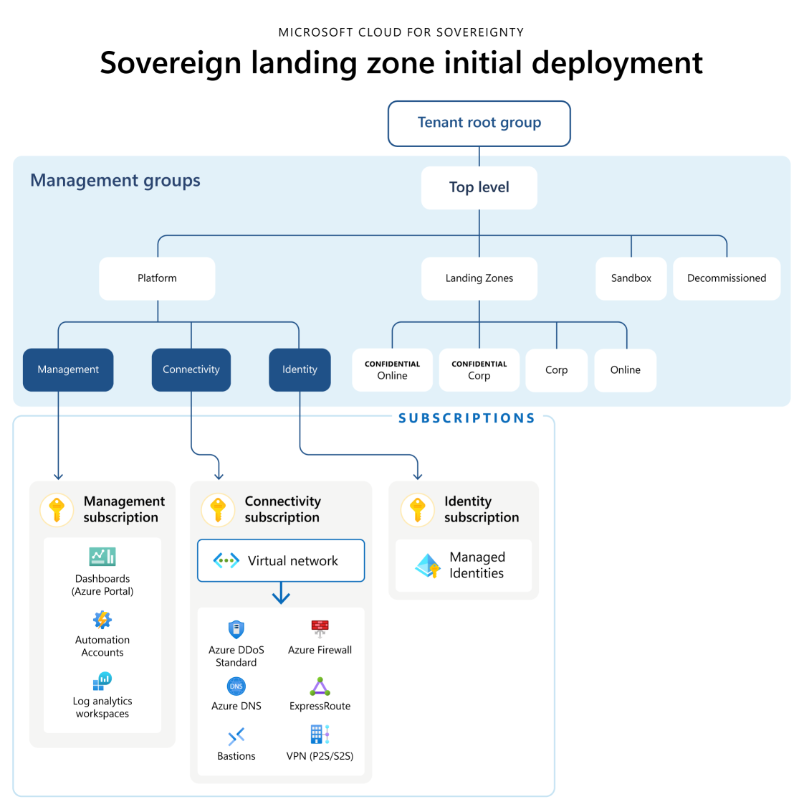

# Architecture of the Sovereign Landing Zone (SLZ)

## Overview

The SLZ architecture is derived from the Azure Landing Zone architecture. For detailed information about the Azure Landing Zone please visit the [What is an Azure landing zone?](https://learn.microsoft.com/azure/cloud-adoption-framework/ready/landing-zone/) doc.

The SLZ is composed of a management group hierarchy along with common platform resources to facilitate networking, logging, and managed service identities. Application workloads can be deployed into a SLZ environment in 1 of the 4 default landing zones:

- **Corp** - Non-internet facing, non-confidential workloads
- **Online** - Internet facing, non-confidential workloads
- **Confidential Corp** - Non-internet facing, confidential workloads (only allows confidential computing resources to be used)
- **Confidential Online** - Internet facing, confidential workloads (only allows confidential computing resources to be used)

The assigned policies in each of the landing zones are designed to support the behavior and connectivity profiles of the workloads deployed. Organizations can [create new management groups](scenarios/Expanding-SLZ-ManagementGroups.md) and further customize the assigned policies as is necessary.

The SLZ deploys under the [tenant root group](https://learn.microsoft.com/azure/governance/management-groups/overview#root-management-group-for-each-directory) in Azure, so it can support brownfield deployments, greenfield deployments, and multiple SLZ deployments within the same tenant based on customer need. The SLZ can also be deployed to an arbitrary [child management group](scenarios/Piloting-SLZ.md), which is better suited for conducting a proof-of-concept.

## Next Step

[Overview of the Sovereign Landing Zone deployment](03-Deployment-Overview.md)

### [Microsoft Legal Notice](./NOTICE.md)
