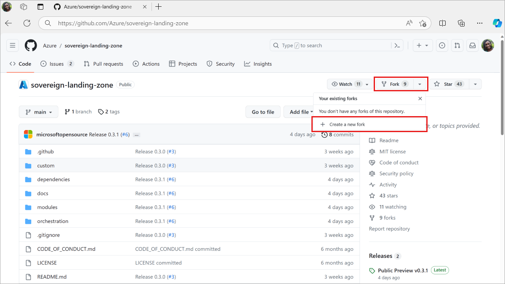
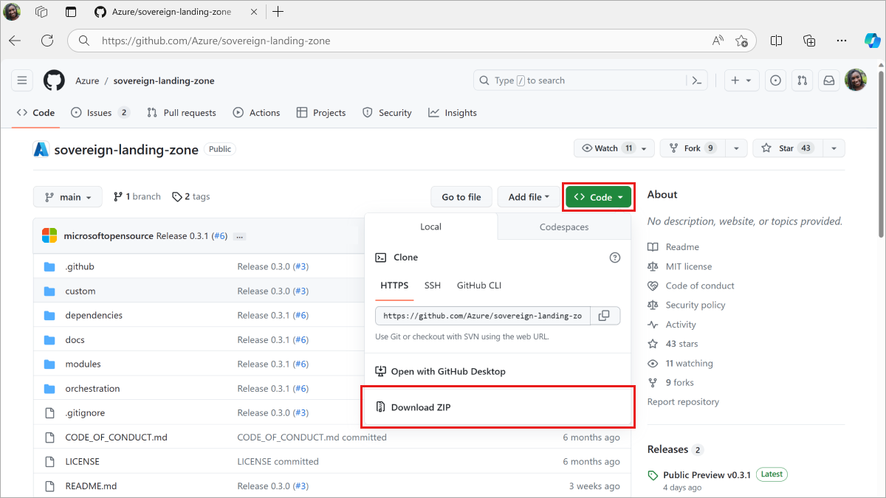

# Set up the Sovereign Landing Zone Repository

Below are some options for setting up the [SLZ GitHub repository](https://github.com/Azure/sovereign-landing-zone) for your use. We recommend that you use the process that is best suited for your organization.

## Download the GitHub Repository

### Option 1 (Recommended)

For contributing and best practice for receiving updates, follow the steps outlined here to [clone or fork the repository](https://docs.github.com/en/get-started/quickstart/fork-a-repo).
#### Clone Repository
```
git clone https://github.com/Azure/sovereign-landing-zone
```
#### Fork Repository
  

The version of the SLZ being used can be determined from the [git tag](https://git-scm.com/docs/git-tag) or the [release version](https://docs.github.com/en/repositories/releasing-projects-on-github/about-releases) the clone or fork was made from.

### Option 2

If you do not plan on contributing or do not intend to receive updates, you can simply download a copy of the [repository](https://github.com/Azure/sovereign-landing-zone) to your local machine, and unzip.

  

The version of the SLZ being used can be determined from the [release version](https://docs.github.com/en/repositories/releasing-projects-on-github/about-releases) the zip file was downloaded from. The version number will be in the file name of the zip file.

## Next step

[Confirm your Permissions and necessary tooling](05-Permissions-Tooling.md)

### [Microsoft Legal Notice](./NOTICE.md)
