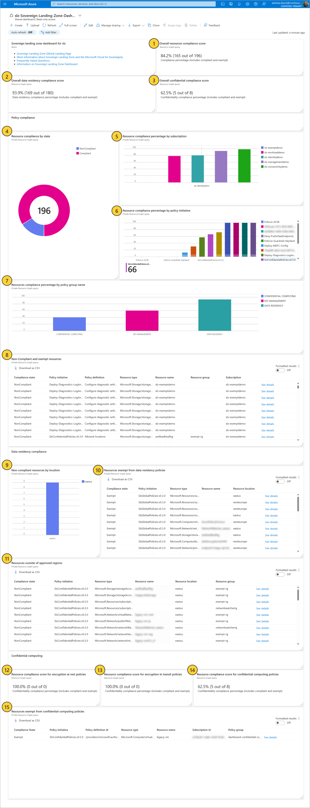

# Compliance Dashboard

## Overview

[Sovereign Landing Zone Compliance Dashboard](https://portal.azure.com/#dashboard) provides customers with a singular page that aggregates various Azure policy compliance views and queries to show an overview of their resource compliance. Customers can get insight into this resource-level compliance against the baseline policies deployed with the SLZ as well as additional custom compliance that has been deployed.

The [Sovereign Landing Zone Compliance Dashboard](https://portal.azure.com/#dashboard) can be accessed in the Shared Dashboards section of the Azure Portal. The naming convention follows the pattern `${parDeploymentPrefix}-Sovereign-Landing-Zone-Dashboard-${parDeploymentLocation}`, utilizing the parameters provided during deployment.

## Dashboard Tiles

The compliance dashboard is customizable and [can be extended](scenarios/Extending-Compliance-Dashboard.md) as needed. The tiles that are deployed as part of the baseline SLZ are described below. Note that resources deployed within the portal may create multiple internal resources or components that are tracked separately by the compliance score. This notion is shared across all tiles, so the total count numbers displayed for compliance may be different from the total resource count number.

| Key | Tiles | Description |
|-----|--------|-------------|
| 1 | Overall resources compliance score | Indicates the number of resources in the SLZ top-level management group are compliant with all policies applied within the SLZ. This calculation is also inclusive of the policies and initiatives assigned by the customer. |
| 2 | Overall data residency compliance score | Indicates the number of resources in the SLZ top-level management group that are compliant with data residency policies applied within the SLZ. |
| 3 | Overall confidential compliance score | Indicates the number of resources in the SLZ top-level management group are compliant with encryption policies meant to keep data confidential and encrypted from Microsoft as the cloud operator. Note that resources of a valid SKU do not contribute to the total resource count by design: [Update in Policy Compliance for Resource Type Policies](https://azure.microsoft.com/updates/general-availability-update-in-policy-compliance-for-resource-type-policies/) |
| 4 | Resource compliance by state | Number of resources that are in each compliance state as evaluated by Azure Policy. |
| 5 | Resource compliance percentage by subscription | Resource compliance percentage for each subscription that has applicable resources under it. This count also includes compliance reports for resource group and subscription compliance. |
| 6 | Resource compliance percentage by policy initiative | Resource compliance percentage for each policy initiative that has applicable resources under it. Supports custom initiatives if the policy initiative is being applied to applicable resources. This count also includes compliance reports for resource group and subscription compliance. |
| 7 | Resource compliance percentage by policy group | Resource compliance percentage for each policy group (prefixed with so.) that has applicable resources enumerated as a policy group in the SLZ bicep. The calculations on this tile cannot be directly verified via the Azure Policy section of Azure portal. |
| 8 | Non-Compliant and exempt resources | Non-compliant and exempt resources as well as relevant information to act against those resources. Resources within the Confidential Corp and Confidential Online Management Groups are expected to be exempt from the Allowed locations policy within the SlzGlobalPolicies initiative as the Allowed locations policy within the SlzConfidentialPolicies initiative supersedes this. |
| 9 | Non-compliant resources by location | Resources that are in regions outside of the custom defined safe regions list. The tile will only show resources that are in locations which are not allowed by the data residency policy. Currently, we have 1 data resident policy (Allowed locations). To view the data please verify there are resources present beyond the safe regions supported by the data resident policy. |
| 10| Resource exempt from data residency policies | Resources that have been made exempt to data residence policies with actionable information. Resources within the Confidential Corp and Confidential Online Management Groups are expected to be exempt from the Allowed locations policy within the SlzGlobalPolicies initiative as the Allowed locations policy within the SlzConfidentialPolicies initiative supersedes this. |
| 11 | Resources outside of approved regions | All non-compliant resources and their location with enough detail to act. The tile will show resources that are in locations which are exempted under the data residency policy. Currently, we have 1 data resident policy (Allowed locations). To view the data please verify there are resources present beyond the safe regions supported by the data resident policy and there’s an exemption created for those resources. Resources within the Confidential Corp and Confidential Online Management Groups are expected to be exempt from the Allowed locations policy within the SlzGlobalPolicies initiative as the Allowed locations policy within the SlzConfidentialPolicies initiative supersedes this. |
| 12 | Resource compliance score for encryption at rest policies | Percentage of resources that are compliant with the encryption at rest policy group. The calculations on this tile cannot be verified via the Azure Policy section of Azure portal. |
| 13 | Resource compliance score for encryption in transit policies | Percentage of resources that are compliant with the data transit encryption policy group. The calculations on this tile cannot be verified via the Azure Policy section of Azure portal. |
| 14 | Resource compliance score for confidential computing policies | Percentage of resources that are compliant with the confidential computing policy group. The calculations on this tile cannot be verified via the Azure Policy section of Azure portal. |
| 15 | Resource exempt from confidential computing policies | Shows the resources that have been made exempt from confidential policies with enough detail to act. The calculations on this tile cannot be verified via the Azure Policy section of Azure portal. Resources within the Confidential Corp and Confidential Online Management Groups are *NOT* expected to be exempt from the Allowed locations listed here as this tile shows the exemptions of the SlzConfidentialPolicies initiative. |

## Next step

[Conclusion](11-Conclusion.md)

### [Microsoft Legal Notice](./NOTICE.md)
