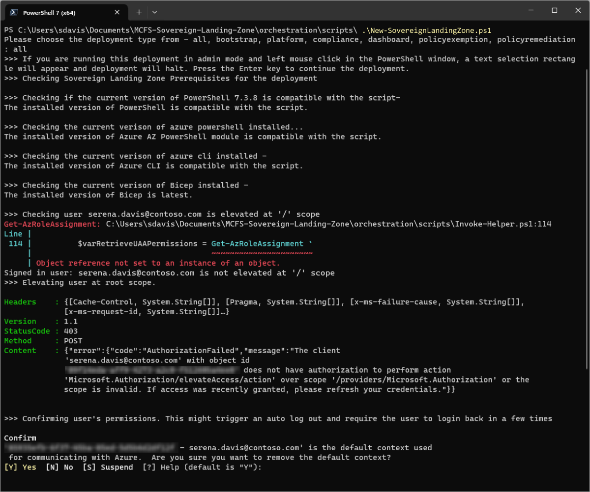
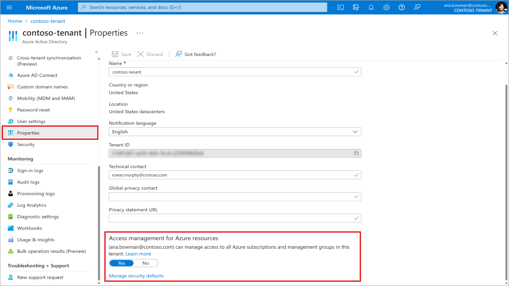

# Sovereign Landing Zone - Frequently Asked Questions

This document answers the most common questions related to the Sovereign Landing Zone deployment and modules.

To report issues or get support, please submit a ticket through [GitHub Issues](https://github.com/Azure/sovereign-landing-zone/issues) or review the [troubleshooting docs](./13-Troubleshooting.md).

## Sovereign Landing Zone

### Why use Bicep over Terraform?

There are a wide variety of deployment technologies available for customers to choose from and Terraform is commonly used to simplify operations especially for organizations that are multi-cloud. Bicep was selected as the first deployment technology to use for the SLZ, and we will endeavor to support additional languages based upon customer need. Submit a [feature request](https://github.com/Azure/sovereign-landing-zone/issues) to let us know which ones are important for you!

### Is SLZ an Application / Workload?

The SLZ is not an application, but rather simplifies the process for deploying or migrating an application to Azure. For more details about landing zones and how they support Azure adoption, review the [Cloud Adoption Framework](https://learn.microsoft.com/azure/cloud-adoption-framework/ready/landing-zone/) docs on this subject.

## Permissions and Tooling

### How do I create an enrollment ID?

The specific steps vary depending on the Azure Account type you are using. For more information visit the [Create Azure subscriptions programmatically](https://learn.microsoft.com/azure/cost-management-billing/manage/programmatically-create-subscription), which describes everything required to create subscriptions for each Azure Account type.

### Why do I need elevated permissions to deploy the Sovereign Landing Zone?

This permission is no longer needed, but can be useful for organizations that are getting started with Azure. For more details about permissions review the docs on the [current recommended permissions](./05-Permissions-Tooling.md) or [reduced permission sets required](./scenarios/Piloting-SLZ.md).

### Why do I get an error when I try to login using `az login` about no subscriptions?

To login to a tenant where no subscriptions exist, please use this command: `az login --allow-no-subscriptions`.

### Why do I get 'User Permission Check Failed' error?

Elevating permissions is no longer required, but it may be useful for organizations that are getting started with Azure. For more details about permissions review the docs on the [current recommended permissions](./05-Permissions-Tooling.md) or [reduced permission sets required](./scenarios/Piloting-SLZ.md).

If elevating permissions is the preferred route for your organization, you may get an error such as:



Navigate to the Azure Active Directory Properties screen and ensure `Access management for Azure resources` is set to `Yes`.



### Why am I still getting an error about permissions even after my permissions have been elevated?

If you are using Azure CLI, you may need to logout using `az logout` and reconnect. If you are still having issues, please contact your Global Administrator or log an [Issue](https://github.com/Azure/sovereign-landing-zone/issues).

### Why am I unable to connect to Azure or run az commands?

You may not have the latest versions of Azure CLI and Bicep installed. Confirm that you are on the latest version of both and try connecting again.
Check [Permissions and Tooling](/docs/05-Permissions-Tooling.md) for more information.

### Why are the scripts using the wrong user?

For individuals that have multiple accounts, it may happen that an unexpected account is currently active causing the SLZ to use it for deployments. This can be resolved by running `Disconnect-AzAccount` in PowerShell to logout, then running `Connect-AzAccount` to log back in with the right account.

## Deploying the Sovereign Landing Zone

### Why did my deployment pause in PowerShell?

This could be due to a left mouse click in the PowerShell window, causing the window to enter a text selection mode. Pressing Enter will restart the deployment. 

### Why is the script retrying and failing even after I have confirmed that I have the right permissions?

It may take several hours for billing permissions required to setup or use a billing scope to go into effect, during which point the SLZ will not be deployable. Please run the `Confirm-SovereignLandingZonePrerequisites.ps1` script, and wait around 4 hours before retrying the deployment.

### When running the deployment script, I get a "DeploymentFailed" error with the description "The aggregated deployment error is too large. Please list deployment operations to get the deployment details. Please see `https://aka.ms/DeployOperations` for usage details." How do I fix this?

Please re-try running the script to fix this error. Log an Issue if the problem persists.

### Why am I getting a "deployment already exists" error?

This commonly because a previous SLZ deployment shared the same prefix and suffix. You'll need to clean up the old deployment if you want to reuse the prefix and suffix set.

This can be accomplished by running the `Remove-AzDeployment` command in PowerShell. For Azure CLI, use the `az deployment tenant delete -n <deploymentname>` or `az deployment mg delete -management-group-id --name` commands.

*Please be aware and careful when using the delete command. Any resources and workloads that were migrated will also be deleted.*

### Why am I getting a "Subscription Alias Already Exist" error?

This commonly because a previous SLZ deployment shared the same prefix and suffix. See the `Why am I getting a "deployment already exists" error?` FAQ for resolution steps.

### I am getting a 'ReferencedResourceNotProvisioned' error. How do I resolve this?

If you encounter this error, it is likely due to a transient issue with resource availability. The SLZ deployment script has retry logic to resolve these types of issues, but it may be necessary to rerun the SLZ deployment script if the script terminates.

If it is a viable option, you can attempt deployment to a different region.

### Why am I getting a deployment failure when attempting to deploy the platform?

This error is likely to occur if the subscriptions being created in the Bootstrap step are not yet active. Wait 30 minutes and try again. If the problem persists, please log an [Issue](https://github.com/Azure/sovereign-landing-zone/issues).

    {
    "status": "Failed",
    "error": {
    "code": "DeploymentFailed",
    "message": "At least one resource deployment operation failed. Please list deployment operations for details. Please see https://aka.ms/DeployOperations for usage details.",
    }

### What are the allowed Azure resource types for confidential management groups (Confidential Corp and Confidential Online)?

For an overview of confidential computing resources in Azure please refer to this [documentation.](https://learn.microsoft.com/azure/confidential-computing/overview-azure-products) The list used by the SLZ can be found [here](../../dependencies/infra-as-code/bicep/modules/policy/assignments/lib/policy_assignments/policy_assignment_es_enforce_sovereignty_baseline_conf.tmpl.json), and the list can be customized to meet an organization's needs.

### What information should I consider removing from my failed deployment details logs?

Under `/modules/util/Get-FailedDeploymentDetails.ps1` is a PowerShell script that aids in generating the logs for the failed deployments. Execute this script to share the deployment error logs with Microsoft for troubleshooting.

This script may capture some information that you should consider removing before sending to Microsoft based on the parameters provided. Below we explain where this information can be surfaced so that you know what text from the JSON file you can consider removing before sending to Microsoft.

#### tenantlogs.json considerations

In the generated `tenantlogs.json` consider the following. If you enter your name, like `ABC`, as a deployment prefix, your name may appear in a few areas of the log file:

* In any `targetResource.id` you may see the following `"id": "/providers/Microsoft.Subscription/aliases/ABC-identity"`.
* In `targetResource.resourceName` you may see the following `"resourceName": "ABC-identity"`, for example.

#### managementgrouplogs.json considerations

In the generated `managementgrouplogs.json` consider the following. If you enter your company name, like `xbox`, as a deployment prefix, the company name may appear in a few areas of the log file:

* In any `targetResource.id` you may see the following `"id": "/subscriptions/aec8ebac-dc86-4012-b19a-b4fdea23e635/resourceGroups/rg-xbox-hub-network-eastus/providers/Microsoft.Resources/deployments/xbox-deploy-Hub-Network-20221104T205002Z"`
* In any `targetResource.resourceName` you may see the following `"resourceName": "xbox-deploy-Hub-Network-20221104T205002Z"`
* In any `targetResource.resourceGroup` you may see the following `"resourceGroup": "rg-xbox-hub-network-eastus"`.

Also consider the information stored in the `properties.statusMessage.message` as this may contain information on the prefix used.

### I am getting an error that says "Unable to edit or replace deployment..." What should I do?

This error indicates that there is an active deployment in progress while an attempt is being made to start the same deployment again. Wait for the deployment to complete and then run the deployment again, if required.

### I am getting a different deployment error. Where can I find more information?

Please reference the Microsoft Learn document that addresses [common Azure deployment errors](https://learn.microsoft.com/azure/azure-resource-manager/troubleshooting/common-deployment-errors).

### Why am I getting an error message stating `Account already exists in another resourcegroup in a subscription`

This commonly happens with Private Preview customers attempting to upgrade to the current release version. For more details look at our [upgrade documentation](./06-Upgrade-Existing-SLZ-Preview.md).

### Why do I keep getting an error message stating creating the deployment will exceed the quota of '800'?

In most cases this will be automatically resolved in 1-2 hours. Azure will keep a deployment history up to the most recent 800 deployments and by default it will automatically prune this history down to the most recent 600 deployments. However, if multiple deployments are being made in rapid succession, it's possible to hit the max history of 800 before automatic systems can remove older deployments.

More details can be found at [https://aka.ms/800LimitFix](https://aka.ms/800LimitFix)

While it's recommended to wait for Azure to automatically clean up the deployment history, some users may need an immediate fix. Below is a reference script that can be used to resolve the issue. It is necessary for users to review this script to ensure it's only deleting the relevant deployment history as this action is not reversible.

```
    #EXAMPLE SCRIPT ONLY, USER-SPECIFIC MODIFICATIONS REQUIRED
    
    #provide deployment prefix and suffix for which deployment history needs to be deleted
    $parDeploymentPrefix = ""
    $parTopLevelManagementGroupSuffix = ""

    #fetch all management groups
    $varManagementGroupId = "$parDeploymentPrefix$parTopLevelManagementGroupSuffix"
    $response = Get-AzManagementGroup -GroupName $varManagementGroupId -Expand -Recurse
    $managementGroups = @($varManagementGroupId)
    
    foreach ($children in $response.Children) {
      $managementGroups += $children.Name;
      if($children.Count -gt 0) {
        for ($i=0; $i -le $children.Count; $i++) {
          $managementGroups += $children[$i].Children.Name
        }
      }
    }

    #fetch all subscriptions under the managementGroups
    $subscriptions = @()
    foreach($mg in $managementGroups ) {
      if($mg) {
        $subscriptions += Get-AzManagementGroupSubscription -GroupName $mg
      }
    }

    #fetch resource groups under the subscriptions and for each resource groups get the deployments name and delete the corresponding deployment from deployment history
    $subscriptions | ForEach-Object {
      Set-AzContext -SubscriptionName $_.DisplayName
      Get-AzResourceGroup | ForEach-Object {
        $deployments = Get-AzResourceGroupDeployment -ResourceGroupName $_.ResourceGroupName
        foreach ($deployment in $deployments) {
          Remove-AzResourceGroupDeployment  -ResourceGroupName $_.ResourceGroupName -Name $deployment.DeploymentName
        }
      }
    }
```

### Can I Use a Managed Identity / Service Principal to Deploy the SLZ?

Yes, provided this identity has been successfully authenticated prior to initiating the deployment such as through an `az login` command. The `New-SovereignLandingZone.ps1` script has two relevant CLI parameters that should be used:

* *parDeployment*: Default `null`. This parameter specifies the deployment type so it doesn't need to be typed in manually.
* *parAttendedLogin*: Default `$true`. This parameter tells the script to perform various login and validation steps that are not necessary when using a managed identity.

A managed identity with appropriate permissions and running in a context with all necessary modules installed can deploy the SLZ through a command such as this:

```
.\New-SovereignLandingZone.ps1 -parDeployment all -parAttendedLogin $false
```

Reference our [pipeline deployments](./scenarios/Pipeline-Deployments.md) document for additional details.

### Can I Choose which Parameter File to Use?

Yes, for many organizations with multiple SLZ deployments it is advisable to minimize operational activities by creating a new parameter file for each SLZ deployment. The `New-SovereignLandingZone.ps1` script has one relevant CLI parameter that should be used:

* *parParametersFilePath*: Default `.\parameters\sovereignLandingZone.parameters.json`. This is the relative path from the `New-SovereignLandingZone.ps1` script to the parameter file.

An organization with multiple SLZ deployments each with a unique parameter file in the local parameters directory can manage a new deployment through a command such as this:

```
.\New-SovereignLandingZone.ps1 -parParametersFilePath .\parameters\testSLZ.parameters.json
```

Reference our [pipeline deployments](./scenarios/Pipeline-Deployments.md) document for additional details.

### Why are my Route Tables and NSGs Being Removed?

This was originally an issue in earlier versions of the SLZ. Currently, the SLZ supports a variety of [BYO resources](./scenarios/Using-Existing-Resources.md) including Route Tables and NSGs. When configured, the SLZ will not attempt to modify these resources but will ensure they are assigned to the specified subnets.

## Compliance Dashboard

### How can I give 'read only' access to a user in my organization to the dashboard?

You will need to assign an Azure `Reader` role the user at the top-level management group scope. Please follow instructions here on how to add an Azure role: [Azure Role Based Access Control](https://learn.microsoft.com/azure/role-based-access-control/role-assignments-portal)

### [Microsoft Legal Notice](./NOTICE.md)
