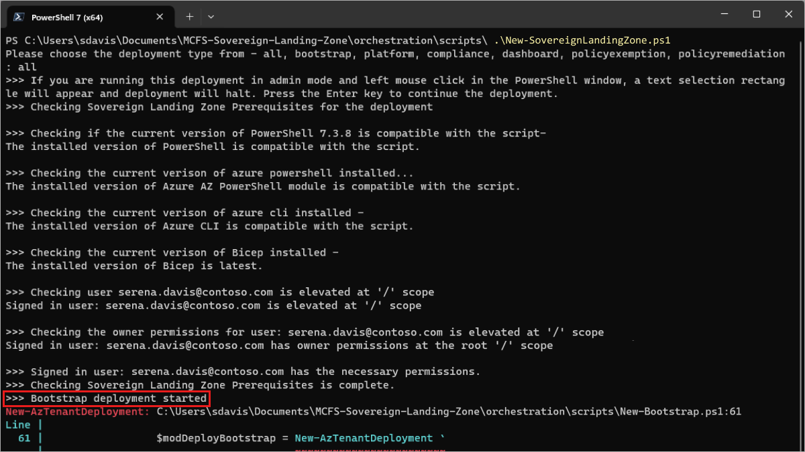
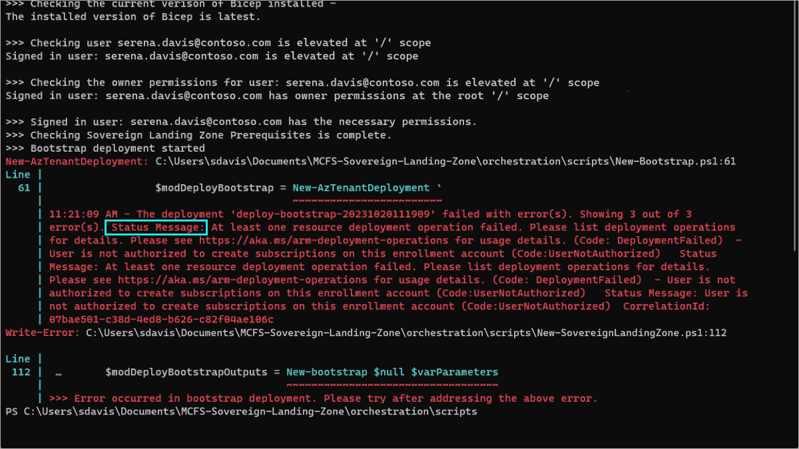

# Troubleshooting

If you are running into issues with your SLZ deployment, review the common troubleshooting topic here or common questions in the [FAQ](./12-FAQ.md). If neither of these resolve your issue, please reach out for assistance through your standard support process or file a [GitHub issue](https://github.com/Azure/sovereign-landing-zone/issues) with us. 

## Determining Deployment Steps

When a user creates or updates the SLZ, they will execute the `/orchestration/scripts/New-SovereignLandingZone.ps1` script. This script has a required `parDeployment` parameter, but it will also prompt the user to select if not provided. Review the [deployment overview](./03-Deployment-Overview.md) doc for more information about deployment steps.
 
Any time the user should be informed of a specific log, that log will start with `>>>` including when a deployment step is beginning or ending. When an error occurs, the current deployment step will be the last deployment step printed in the logs. The screenshot below shows an example for the bootstrap deployment step.



## Determining Error from the Error Message

When an error occurs, the error message will most often be presented in a human readable format in red text, with the relevant details being contained within the `Status Message` field as seen below or in a generic `Message` field.



## Bicep Errors

### Using a type union declaration requires enabling EXPERIMENTAL feature "UserDefinedTypes".

Commonly, this is caused by having 2 versions of Bicep installed where one version is not being updated. This can be checked by running:

```
az bicep version
bicep --version
```

Make sure both installs have the [required minimal version.](./05-Permissions-Tooling.md#tooling-required)

## Bootstrap Errors

### User is not authorized to create subscriptions on this enrollment account.

This error means that the SLZ parameter `parSubscriptionBillingScope` value is not valid. Refer to the [permissions setup](./05-Permissions-Tooling.md) doc for more details about the permissions required for your Azure Agreement type.

Once a valid value is provided, rerun the SLZ deployment.

### The provided location [LOCATION] is not available for deployment.

This error means that the SLZ parameter `parDeploymentLocation` value is referring to a region that the user does not have permissions to use. This is commonly the case when there is a typo in this value.

Once a valid value is provided, rerun the SLZ deployment.

### Invalid deployment location [LOCATION]. The deployment [DEPLOYMENT NAME] already exists in location [OTHER LOCATION].

This error commonly means that the `parDeploymentLocation` value has been changed when trying to update an existing SLZ deployment, or that the `parDeploymentPrefix` and `parDeploymentSuffix` value pair is already being used by an existing SLZ deployment.

If you are attempting to move the SLZ deployment, you will need to instead create a new SLZ deployment with a unique `parDeploymentPrefix` and `parDeploymentSuffix` value pair as Azure resources in general cannot be moved.

If an existing SLZ deployment is already using the `parDeploymentPrefix` and `parDeploymentSuffix` value pair, you will need to select a new value for one or both of those parameters. Once a valid set of values are provided, rerun the SLZ deployment.

## Platform Errors

### [Subnet] has an invalid CIDR notation.

This error commonly occurs when the subnet CIDR range for one of the subnets is outside the hub VNET CIDR range. You will need to review the `parHubNetworkAddressPrefix`, `parAzureBastionSubnet`, `parGatewaySubnet`, `parAzureFirewallSubnet`, and `parCustomSubnets` parameters to ensure there are no overlaps and all subnet ranges are within the hub VNET CIDR range.

Once valid values are provided for the hub VNET and subnets, rerun the SLZ deployment.

### Resource [LOG ANALYTICS WORKSPACE RESOURCE OR SOLUTION ID] was disallowed by policy.

This error means that the SLZ Global Defaults policy assignment has been configured to block the `parDeploymentLocation`. This commonly occurs when trying to update an existing SLZ deployment. You will need to review the `parAllowedLocations` array to ensure it contains the `parDeploymentLocation` value.

Once a valid value is provided, run the SLZ `compliance` deployment step to update the policy assignment, then rerun the SLZ deployment. This error is related to the other ones where policy is blocking the resource.

### Put on Firewall Policy [AFW POLICY] Failed with 1 faulted referenced firewalls

This error occurs when the SLZ orchestration is ran a second time after post-deployment modifications have been made to the AFW Policy. The SLZ orchestration will attempt to revert these changes to a null state, causing the error. It is necessary to set the `parAzFirewallPoliciesEnabled` parameter within the parameter file to disable this action.

## Dashboard Errors

### Resource [DASHBOARD RESOURCE GROUP NAME] was disallowed by policy.

This error means that the SLZ Global Defaults policy assignment has been configured to block the `parDeploymentLocation`. This commonly occurs when trying to create a new SLZ deployment. You will need to review the `parAllowedLocations` array to ensure it contains the `parDeploymentLocation` value.

Once a valid value is provided, run the SLZ `compliance` deployment step to update the policy assignment, then rerun the SLZ deployment. This error is related to the other ones where policy is blocking the resource.

### [Microsoft Legal Notice](./NOTICE.md)
