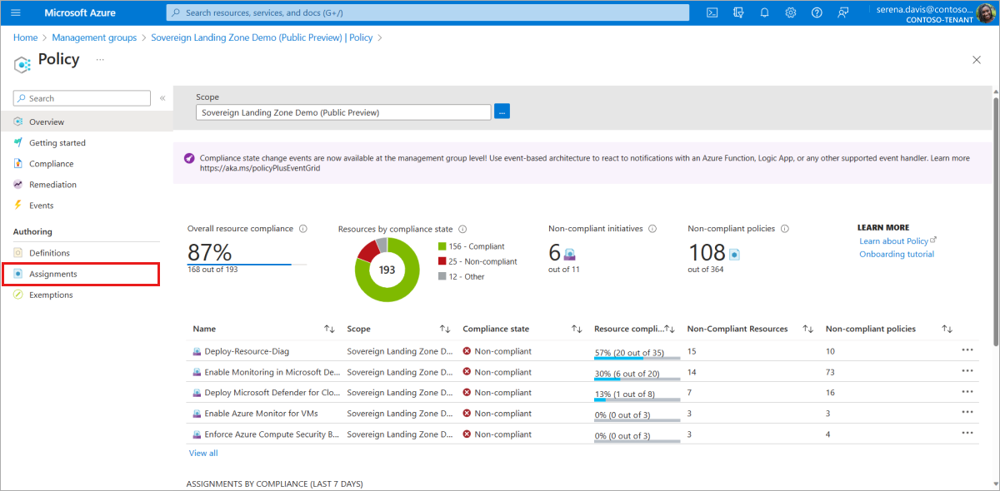

# Removing Policy Assignments

There are several options for the SLZ to deploy policies. However, the SLZ does not remove policy assignments by design. Policy assignments are the technical guardrails used by governance and security teams, and we want removing of policy assignments to be an intentional effort instead of an accidental one caused by a misconfiguration. To remove a policy assignment, the SLZ parameter file needs to be updated to ensure it does not attempt to recreate the assignment then a secondary or manual process must go through and remove the assignment.

Upgrades to the Sovereignty Baseline policy initiatives or any of the built-in Microsoft Cloud for Sovereignty policy portfolio initiatives will be automatically addressed without secondary steps or manual intervention.

## Removing Old Custom Policies

Update the [custom policy definitions](../../custom/policies/definitions/) by removing the old policies out of the definitions and incrementing the version number before redeploying the SLZ. The SLZ will automatically remove the old definition assignment during the upgrade process.

## Removing Old Policy Portfolio Assignments

Update the SLZ parameter file and remove the old assignment out of the `parCustomerPolicySets` parameter. This will prevent the SLZ from deploying the assignment in the future.

Navigate to the [Management Group](https://portal.azure.com/#view/Microsoft_Azure_ManagementGroups/ManagementGroupBrowseBlade/~/MGBrowse_overview) view and select the top-level management group for the SLZ deployment. In the policies blade, find the assignment with the same name and manually delete it.

## Removing the ALZ Policies

Update the SLZ parameter file and set `parDeployAlzDefaultPolicies` to `false`. This will prevent the SLZ from deploying the ALZ Policies in the future.

Navigate to the [Management Group](https://portal.azure.com/#view/Microsoft_Azure_ManagementGroups/ManagementGroupBrowseBlade/~/MGBrowse_overview) view and select the top-level management group for the SLZ deployment, and then select the **Policy** blade. This will ensure you have the appropriate scope selected

  

Navigate to the **Assignments** blade, then for each policy listed below perform the following:

1) Search for the assignment name:

  

2) Select the ellipsis for the assignment:

  

3) Delete the assignment:

  

For further details refer to the [ALZ Assignment Deletion](https://github.com/Azure/ALZ-Bicep/blob/da0af7a5a1f21825b497017f52264df2d29aa0a6/docs/wiki/PolicyDeepDive.md) docs, and for design consideration refer to the [ALZ Policies](https://github.com/Azure/Enterprise-Scale/wiki/ALZ-Policies) doc.

You can find the full list of ALZ Policy Assignment Names below that will need to be removed.

### ALZ Policy Assignments

| **Assignment Name**          | **Definition Name**           |
|--------------------------|---------------------------|
|Deploy Microsoft Defender for Cloud configuration|Deploy Microsoft Defender for Cloud configuration|
|Deploy-Resource-Diag |Deploy Diagnostic Settings to Azure Services |
|Deploy Diagnostic Settings for Activity Log to Log Analytics workspace |Configure Azure Activity logs to stream to specified Log Analytics workspace |
|[Preview]: Deploy Microsoft Defender for Endpoint agent |[Preview]: Deploy Microsoft Defender for Endpoint agent |
|Enable Azure Monitor for Virtual Machine Scale Sets |Enable Azure Monitor for Virtual Machine Scale Sets |
|Configure Azure Defender to be enabled on SQL Servers and SQL Managed Instances |Configure Azure Defender to be enabled on SQL Servers and SQL Managed Instances |
|Configure Advanced Threat Protection to be enabled on open-source relational databases |Configure Advanced Threat Protection to be enabled on open-source relational databases |
|Enable Azure Monitor for VMs |Enable Azure Monitor for VMs |
|Deny the deployment of classic resources |Not allowed resource types |
|Enforce ALZ Decommissioned Guardrails |Enforce ALZ Decommissioned Guardrails |
|Subnets should have a Network Security Group |Subnets should have a Network Security Group |
|Management port access from the Internet should be blocked |Management port access from the Internet should be blocked |
|Web Application Firewall (WAF) should be enabled for Application Gateway |Web Application Firewall (WAF) should be enabled for Application Gateway |
|Kubernetes clusters should not allow container privilege escalation |Kubernetes clusters should not allow container privilege escalation |
|Kubernetes clusters should be accessible only over HTTPS |Kubernetes clusters should be accessible only over HTTPS |
|Kubernetes cluster should not allow privileged containers |Kubernetes cluster should not allow privileged containers |
|Network interfaces should disable IP forwarding |Network interfaces should disable IP forwarding |
|Enforce recommended guardrails for Azure Key Vault |Enforce recommended guardrails for Azure Key Vault |
|Secure transfer to storage accounts should be enabled |Secure transfer to storage accounts should be enabled |
|Deploy Threat Detection on SQL servers |Configure Azure Defender to be enabled on SQL servers |
|Configure backup on virtual machines without a given tag to a new recovery services vault with a default policy |Configure backup on virtual machines without a given tag to a new recovery services vault with a default policy |
|Deploy TDE on SQL servers |Deploy TDE on SQL servers |
|Deploy Azure Policy Add-on to Azure Kubernetes Service clusters |Deploy Azure Policy Add-on to Azure Kubernetes Service clusters |
|Deny or Deploy and append TLS requirements and SSL enforcement on resources without Encryption in transit |Deny or Deploy and append TLS requirements and SSL enforcement on resources without Encryption in transit |
|Configure SQL servers to have auditing enabled to Log Analytics workspace |Configure SQL servers to have auditing enabled to Log Analytics workspace |
|Deny the deployment of vWAN/ER/VPN gateway resources |Not allowed resource types |
|Audit Private Link Private DNS Zone resources |Audit the creation of Private Link Private DNS Zones |
|Public network access should be disabled for PaaS services |Public network access should be disabled for PaaS services |
|Deny network interfaces having a public IP associated |Network interfaces should not have public IPs |
|Configure Azure PaaS services to use private DNS zones |Configure Azure PaaS services to use private DNS zones |
|Deny the creation of public IP |Not allowed resource types |
|Deploy-Log-Analytics |Configure Log Analytics workspace and automation account to centralize logs and monitoring |

## Removing the Custom Sovereignty Baseline Policy Initiatives

Starting with v1.1.0 of the SLZ, the delivery mechanism for the Sovereignty Baseline Policy initiatives has changed. Prior to this version they were delivered by the SLZ orchestration as custom initiatives, but starting with this version and going forward the orchestration will use the builtin Azure Policy definitions.

This is only a change to the delivery mechanism, functionally the initiatives are identical but by leveraging the builtin Azure Policy definitions, it becomes easier to deliver and consume of updates to the baseline.

However, after upgrading an existing SLZ deployment to v1.1.0, the old assignments and definitions will need to be manually removed. The above process described for removing ALZ policy assignments should be followed with these assignments:

| **Assignment Name**      | **Scope**                 | **Definition Name**           |
|--------------------------|---------------------------|-------------------------------|
|SLZ Global Policies|Top-Level Management Group|Default Sovereign Landing Zone (SLZ) policies|
|SLZ Confidential Policies|Confidential Corp|Policies to enforce confidential computing|
|SLZ Confidential Policies|Confidential Online|Policies to enforce confidential computing|

### [Microsoft Legal Notice](../NOTICE.md)
